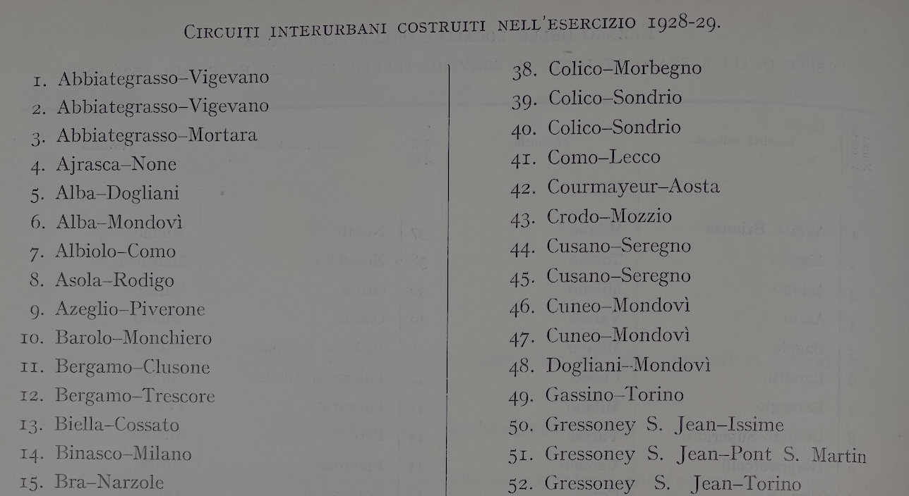
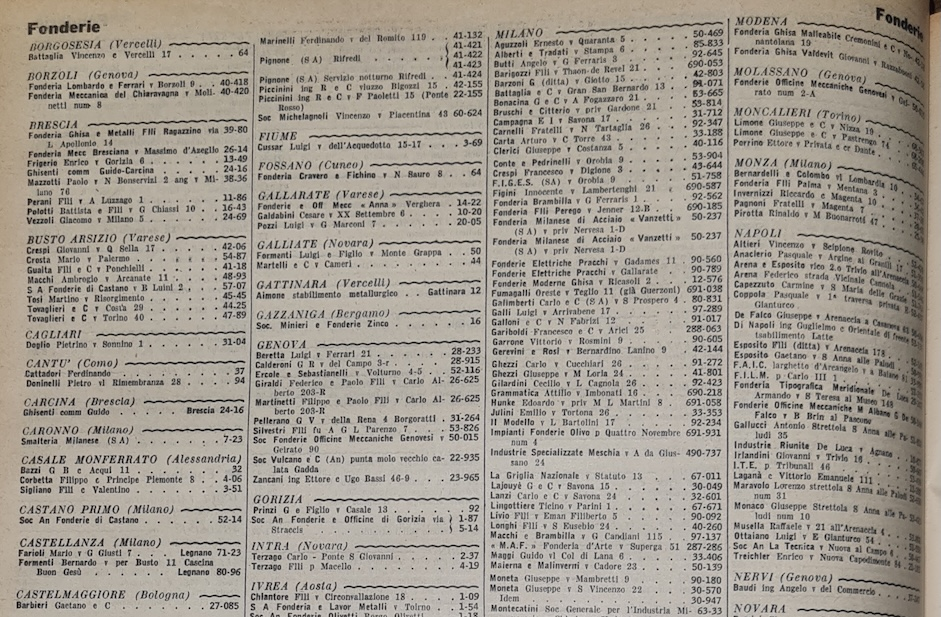
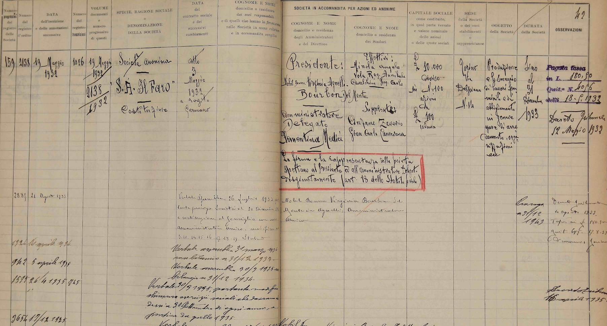
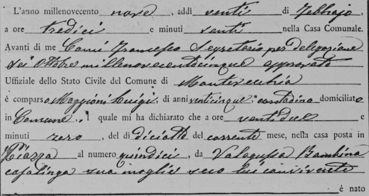
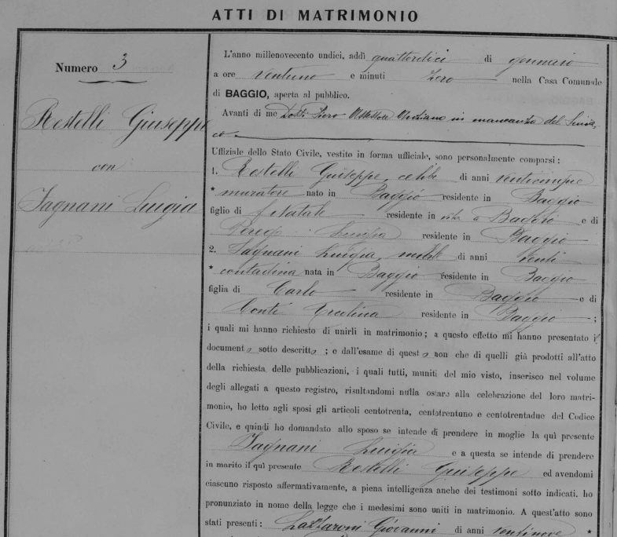
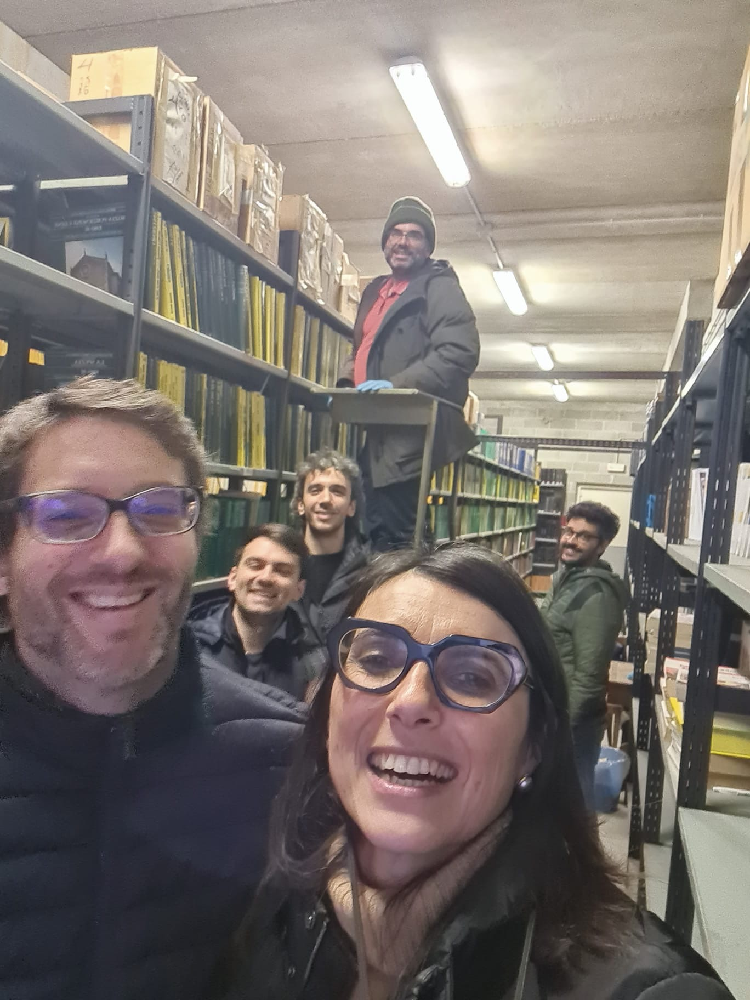

## Telephones

::: {.incremental}

1. What Marina said.
2. Thanks to her and the team!
3. I wrote up an ERC proposal (🤞) titled *`ConnectIT`: Connecting Italy: Communication Infrastructure, Coordination, and
Convergence in the 20th Century*
3. Italy offers an ideal setting.
3. Telephone offers access to *useful information* (Mokyr).

:::

## Projects

::: {.incremental}

1. Local Knowledge Spillovers, Communications Networks, and Growth
2. Migration and Communications
3. Marriage patterns and Communications
4. Social Norms and Communications Technology

:::

## Projects

### Telephones, Productivity Spillovers and Multilocation Firms

::: {.incremental}

1. Do Local Productivity and Economies of Scale depend on the communications network? Which Models.
2. What is the role of the bank branch network?

:::

## Projects

### Telephones, Productivity Spillovers and Multilocation Firms

::: {layout-ncol="2" layout-nrow="1"}

{#fig-1927-SIP}

{#fig-1932-IO}

:::

## Projects

### Telephones, Productivity Spillovers and Multilocation Firms

{#fig-1932-CC-faro}

## Projects

### Telephones and Great Migrations - *Destiny Calling*

::: {.incremental}

1. How do migration decision depend on the communications network? Information collection and expectation formation.
   * Information from _weak links_ is more informative than from _strong links_?
2. Who participated in the great migration after WW2 and where *exactly* did they go?
   * Did the *migration fever* spread like a disease (_a blot of ink on a piece of paper_)?

:::

## Projects

### Telephones and Great Migrations - *Destiny Calling*

::: {layout-ncol="2" layout-nrow="1"}

{#fig-1953-IO}

{#fig-1909-antenati-nascite}

:::

## Projects

### Marriage Markets and Meeting Technology

::: {.incremental}

1. *Thou Shall Marry Thy Neighbor.* 
2. $\Pr((i,j)| C(i)=1, C(j)=1) \approx 10 \times \Pr((i,j)| C(i)=1, C(j)=50)$
3. Most matching models assume full information: observe entire market. Where does strong segregation come from?
4. Did telephone changing marriage patterns? Where? How?
5. How to develop a matching model with local information and partial adjustment dynamics? 
6. How to disentangle preferences over types from the local non-availability of certain types?

:::

## Projects

### Marriage Markets and Meeting Technology

## Give Us a Call! 

::: {.columns}
::: {.column}
* This is a research platform. 
* Give us a call! 📞
:::
::: {.column}

:::
:::
<!-- end columns -->

